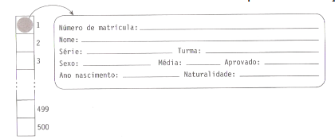

### Desenvolva uma estrutura em C conforme o modelo abaixo e após crie as funções solicitadas:

**a) Cadastrar os dados.**

**b) Apresentar todos os dados.**

**c) Exibir a porcentagem de alunos aprovados e reprovados por turma, totalizados por série.**

**d) Exibir a porcentagem de alunos dosexo masculino e do sexo feminino por turma, totalizados por série.**

**e) Apresentar a média das idades de cada uma das séries.**
